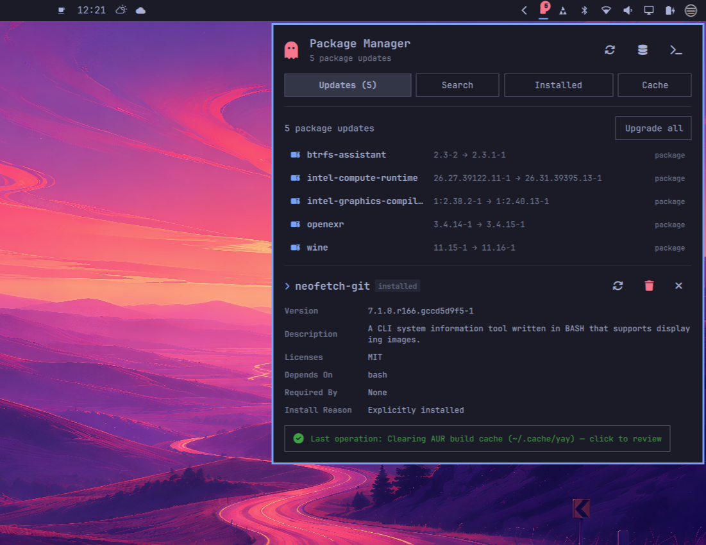

# Pacman for Omarchy

A package manager living in the Omarchy bar: pacman + AUR update notifier, package search, install/remove actions, a live transaction console inside the panel popup, and cache cleaning.



## Features

- **Bar widget** — ghost icon with an update-count badge; icon turns urgent-colored when repo updates are pending (accent color when only AUR updates remain). Click to open the panel.
- **Updates tab** — lists pending repository and AUR updates side by side with current → new versions; one-click *Upgrade* runs the full sync in a transaction view.
- **Search tab** — opens with an alphabetical index of official repo packages; filters live as you type (official repos + AUR at once) with exact-name matches on top, shows installed state and lets you install or remove any result.
- **Installed tab** — browse native vs foreign packages with sizes, jump straight to details, remove packages.
- **Cache tab** — clean the pacman package cache (`paccache`, keeping your chosen number of old versions) and the AUR build cache (`~/.cache/yay`).
- **Live transaction console** — every privileged operation streams its output into the panel itself (no floating terminal); Esc or *Back* returns to the tabs, a "last operation" pill reopens the log afterwards.
- **Details view** — description, version, size, dependencies and more for any package.

All colors follow your active Omarchy theme tokens.

## Requirements

| Dependency | Required | Used for |
|---|---|---|
| Omarchy | yes | Shell / Quickshell bar with the plugin system |
| `pacman-contrib` | yes | `checkupdates` and `paccache` |
| `yay` | optional | AUR search/updates/builds (disable via settings if unused) |
| `zenity` | only for AUR ops | Graphical sudo password prompt when building AUR packages |
| `polkit` agent + `pkexec` | yes | Privileged repo operations (Omarchy ships one) |

## Installation

```sh
omarchy plugin add https://github.com/archlatam/arch.iudc.git --enable
```

Then add the widget from the shell config if it is not enabled automatically (bar section `right` by default).

## Removal

```sh
omarchy plugin remove arch.iudc
```

## Settings

Configurable through the Omarchy plugin settings UI:

| Setting | Type | Default | Description |
|---|---|---|---|
| `refreshIntervalSec` | integer (300–21600) | `1800` | How often update checks run |
| `includeAur` | boolean | `true` | Include AUR updates in checks and upgrades |
| `cacheKeepVersions` | integer (1–5) | `2` | Old package versions kept when cleaning cache |

## IPC control

Scriptable from the terminal or keybinds:

```sh
omarchy-shell arch.iudc toggle    # open/close the panel
omarchy-shell arch.iudc refresh   # force an update check
omarchy-shell arch.iudc upgrade   # start the upgrade transaction
omarchy-shell arch.iudc open      # open without toggling
omarchy-shell arch.iudc close     # close
```

## How privileges work

This plugin performs two kinds of privileged actions, deliberately split:

- **Repository operations** (`pacman -Syu`, installs, removals, `paccache`) are launched with `pkexec pacman …` / `pkexec paccache …`. Polkit prompts for your password using your desktop's standard authentication agent; no password is ever read, stored or transmitted by this plugin.
- **AUR operations** must run as your regular user (never as root), so `yay` is executed unprivileged. Because yay internally calls `sudo` for the final install step, the plugin ships a tiny PATH shim that intercepts those calls: only `sudo pacman …` is escalated silently via `sudo -A` with a `SUDO_ASKPASS` helper backed by a `zenity` password dialog, which displays the exact command being authorized. Any other `sudo` invocation — e.g. one hidden inside a PKGBUILD's prepare/build/package functions — falls through to the real, unmodified sudo, which prompts on the controlling terminal instead of a blank-check GUI dialog. The shim adds no arguments of its own and forwards everything verbatim.

Nothing is downloaded or executed from third-party URLs; all commands operate exclusively on your configured pacman repositories and the AUR.

## License

[MIT](LICENSE) © 2026 m4teo
